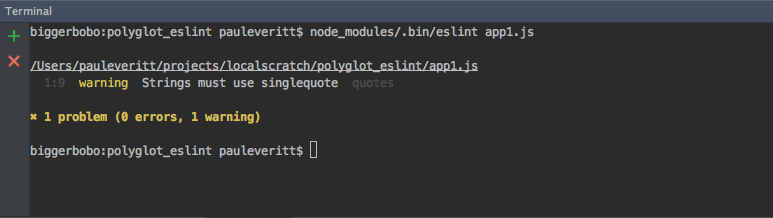
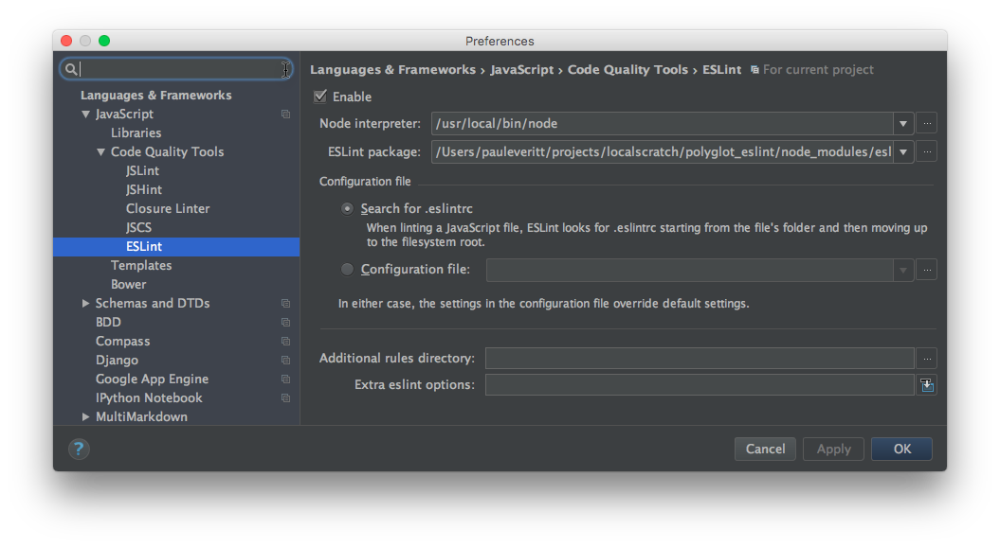
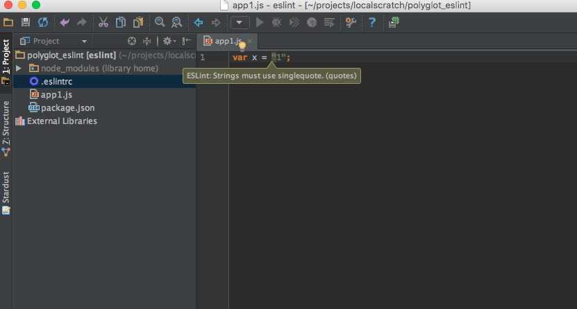

# Linting with ESLint

Are you picky about Python code styling? A big believer in 
[PEP 8](https://www.python.org/dev/peps/pep-0008/)?
The world of JavaScript has linting too.

In this article we take a look at frontend tooling for JavaScript,
namely linting, and how we can hook this into PyCharm.

## Overview

- Show more JS tooling and its support in PyCharm

- Better, more configurable linting with eslint

- Prep for linting on newer JS features

## Linting: Why and What

Smart editors, and certainly IDEs like PyCharm, can help you when
coding, spotting things such as unbalanced quotes and other syntactic
mistakes. They also, though, can tap into tools that help enforce
*style* conventions: rules that, while syntactically legal, are
considered bad form.

These tools are called *linters*. Python has linting software such
as 
[pylint](http://www.pylint.org)
and style guides such as the centrally-maintained 
[PEP 8](https://www.python.org/dev/peps/pep-0008/).
All hail our style overlords!

The world of JavaScript has linting too, though not as much consensus.
jshint, jslint, jscs...quite a history, and PyCharm supports all
of them. Recently, one linter has become the tool of choice
for the modern node/npm toolchain: 
[ESLint](http://eslint.org).
It's fast, flexible, modular, and well-maintained.

Let's plug it in and hook it up to PyCharm.

## Installation

ESLint is written in JavaScript and installable with `npm`. Let's make
a new `package.json` and install `eslint`:

```bash
$ npm init --yes
$ npm install --save-dev eslint
```

The `npm install` command downloads ESLint into our `node_modules`
local packages and records in `package.json` that it is a *development*
dependency. Meaning, the software isn't needed for our application, but
is used by developers when making a sandbox. This distinction can be seen
in our resulting `package.json`:

[include](../../src/eslint/package.json)

If we didn't want to open a console, or couldn't remember the package
name, we could ask PyCharm to find, install, and record the
dependency:

https://www.youtube.com/watch?v=2R7JGBoZPKw

That is, we visit Preferences -> Languages & Frameworks -> Node.js
and NPM, then click the `+` to search for and install `eslint`.
To save the dependency, check the `Options` box and type
`save-dev` into the input.

## Configuration

Style 
[rules](http://eslint.org/docs/user-guide/configuring)
are enforced in a JSON configuration file `.eslintrc` stored at 
the top of the project. For example:

[include, lang:"json"](../../src/eslint/.eslintrc)

This configuration says: "In this project, everyone should use single
quotes in JavaScript files".

## Running

That's nice to record that, but how do we enforce it? Like `pylint`,
you can run a command against your source files and see who has been
naughty and nice. This source file has double quotes:

[include](../../src/eslint/app1.js)

If we "lint" it with the `eslint` command:

```bash
$ node_modules/.bin/eslint app1.js
```
...we get *warnings* that `Strings must use singlequote`:



Remember, ESLint is written in JavaScript as part of the frontend,
Node toolchain. It fits in with the various standards we have been
discussing. In this case, `npm` packages install their console
scripts in `node_modules/.bin`. This is similar to how Python
and `setuptools` entry points create console scripts in your
virtual environment's `bin` directory.

## Command Line? PyCharm!

Of course we don't want to have to run a command to get help about
mistakes. If only we had an IDE that supported modern JavaScript
editing with modern linting?

PyCharm supports the various JavaScript linters, including
first-class support for ESLint. First, enable it in your project
by visiting Preferences -> Languages & Frameworks -> JavaScript
-> Code Quality Tools -> ESLint. Then, enable it, point to the
installed `node_module`, and let it search for the `.eslintrc`
file:



Now when editing a file with a rule violation, PyCharm will provide
real-time warning and errors as you type:



## Wrapup

Like with Python, we now have a JavaScript style configuration file
that can be checked into version control. We can check our styles both
from the command line and in the editor. We can use the command line
to warn during package building and hook it up to Travis during
continuous integration.

As we'll see in a later section, ESLint has another distinguishing
characteristic: its first two letters (ECMAScript) mean it is focused on
future syntaxes in JavaScript, ES2015 and beyond.
