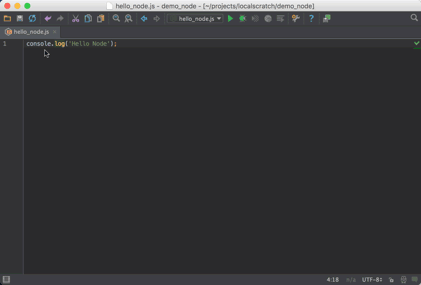
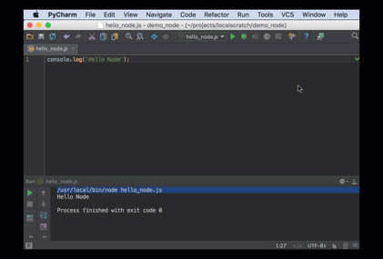

# NodeJS for Python and PyCharm Developers

If you're a Python veteran, you probably don't think too much about
the Python interpreter itself. Sure, you think about different
versions and virtual environments. But it isn't like you won't
have one.

For frontend development, though, it's quite different. You likely
think: "Ugh, I have to run my frontend code through a browser." These
days, though, JavaScript has escaped the browser via 
[Node.js](https://nodejs.org/en/), an environment which resembles Python
in many ways.

In particular, with Node, you have a command-line program which can
load and interpret JavaScript and print the result. Equally, with the
bundled [npm](https://www.npmjs.com>) as a package manager, the
world of Node provides a way to do JavaScript development,
targeting a browser, but without a browser.

In this article we'll take a quick look at how
[PyCharm Professional](https://www.jetbrains.com/pycharm/)
works as an IDE for JavaScript development.

## Overview

- Run the Node.js interpreter from PyCharm

- Configure interpreter settings and packages

- Discuss Node-style virtual environments

## Running JavaScript Code

Let's presume I've installed Node via their installer, Homebrew, or
one of the many other ways. If we have a `hello_node.js` file in
our project, we can execute it via the Node interpreter exactly the
same ways we do Python code. For example, this `hello_node.js`
file:

[include](../../src/hello_node/hello_node.js)

...can be executed from the command line with the `node` command,
just like we use for `python`:

``bash
$ node hello_node.js
Hello Node
``

In PyCharm we can easily
[run Python 
code](https://www.youtube.com/watch?v=JLfd9LOdu_U&list=PLQ176FUIyIUZ1mwB-uImQE-gmkwzjNLjP&index=4) 
using an installed Python interpreter. The same is true for JavaScript
code with an installed Node interpreter:

In this example, we do a right-click on the tab and choose "Run". PyCharm
creates a "Run Configuration" and executes the code in a tool window.
Except in this case, the run configuration isn't of *Python* Run
Configuration. It is a *Node.js* Run Configuration:

## Configuring the Interpreter

Where did PyCharm find the Node executable and what options are there
for configuring it? In the PyCharm preferences, the `JavaScript`
panel holds this information:

Just like with PyCharm's "Python Interpreter" settings, you can
point to the executable on disk for Node. PyCharm gives a visual
way to manage Python packages, instead of running `pip` from the
command-line. Same with Node: This window also lets you manage
packages instead of running `npm` from the command line.

## JavaScript Virtual Environments?

In Python we are taught to develop in isolation using virtual
environments. How does that work in Node, and how does PyCharm
support it?

First, Node is designed around a two-tier global and project
`node_modules` directory for packages. In the case where you
want full isolation, most people use 
[nvm](https://github.com/creationix/nvm) as a way to have multiple,
isolated versions of Node. Once this is in place, configure
your PyCharm project to point at the correct executable for the
nvm-managed Node environment.

## Isn't This Like WebStorm?

This is just a brief introduction of Node.js for Python developers,
showing how it hooks up in PyCharm. We'll cover much more,
particularly in the section on 
[package.json files](./package_json.md).

Many Python developers might ask: should I use
[WebStorm](https://www.jetbrains.com/webstorm)
for my frontend development and PyCharm for my backend development?
While WebStorm does provide a UI more focused on JavaScript development,
both IDEs share the same
[IntelliJ](https://www.jetbrains.com/idea/)
foundations and JavaScript
machinery. As such, you can do your frontend development while
staying in PyCharm.

## Wrapup

In this article we showed how the world of JavaScript exists outside
of the browser, in a command-line interpreter that should be familiar
to Python developers. JavaScript can be executed by the Node interpreter
as a first-class part of PyCharm, just like running Python code.
