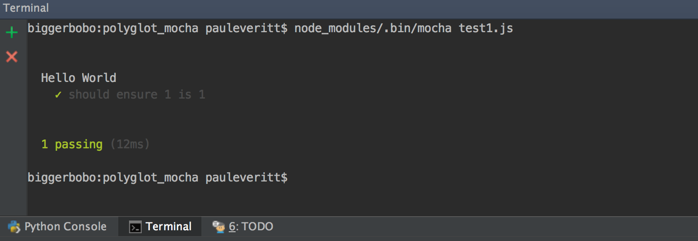
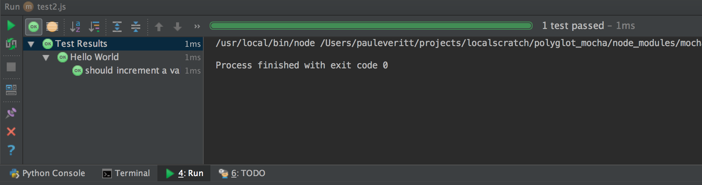
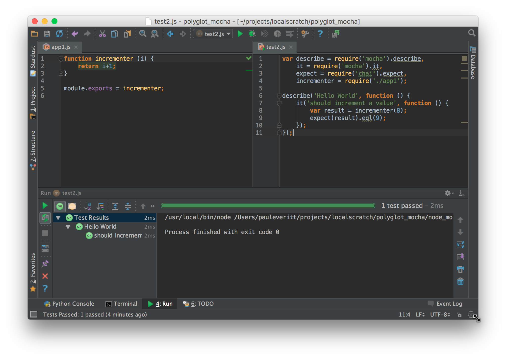

# TDD with Mocha

Python has a strong history with unit testing. In JavaScript? Not so
much, as driving a browser is a pain. But with the emergence of
NodeJS, unit testing with test runners like
[Mocha](http://mochajs.org), 
it's now more feasible to do TDD.

This article introduces a small amount of Mocha, apart from any
particular application. Like our other Polyglot articles, it's
written from a Python perspective.

## Overview

- Explain the virtue of browserless-first frontend development

- Introduce JavaScript testing in the context of Python testing

- Install Mocha and Chai plus a simple test

- Show PyCharm as a UI for Frontend TDD

## Test Runners, Assertions, Mocks

The Python standard library has long had the `unittest` module
as the de-facto unit testing option for test suites, fixtures,
and assertions. While recent alternatives such as `pytest`
have gained traction, most Python developers are familiar with
the built-in test support.

JavaScript isn't anywhere close to that. Over the years different
browser-based solutions appeared, but not only did none gain
a majority, the idea of testing itself never took hold. Most
JavaScript developers have never written a test. It's just not
in the culture.

Recently that has begun to change, particularly with
outside-the-browser environments such as NodeJS. Mocha is a
popular test runner for NodeJS. People often extend Mocha to
use 
[Chai](http://chaijs.org)
for assertions and
[Sinon.JS](http://sinonjs.org)
for mocking.

Usually with this approach, you remove the browser and run
in NodeJS. Let's talk about that for a moment.

## Browserless

This is a funky idea. It's very important, though, so let's go
through it.

Developing via a browser is way, *WAY* different than Python
development. Type, save, change window, reload browser, change
back. And heaven help you if you need to debug.

Wouldn't it be great if you could code the core logic without a
browser, and only check the browser when you needed to? Even better,
wouldn't it be great if we could get into a zen-like TDD mode of
web application development?

In our [previous step](../modules/modules.md) we saw
modular development, *without* a browser. This is a very Pythonic
way of JavaScript development.  Writing reusuable code as modules
is one Pythonic technique. But writing code that is productively
testable during development is another part of Pythonic development.

## Mocha and Chai Installation

Let's start with a new directory containing the `package.json`
and `.eslintrc` from the previous step. Remember that this directory
is like a virtual environment in Python, albeit like one that has
`with-site-packages` set to true. That is, NodeJS looks in your local
`node_modules` first and then in the global environment for a package.

Let's install Mocha and Chai *locally* and save them as development
dependencies in our `package.json`:

```html
$ npm install --save-dev mocha chai
```

After doing this command, we now have a `node_modules` directory
with 21 packages in it, for the Mocha and Chai dependencies.

Our `package.json` should now contain these development dependencies:

[include](../../../src/mocha/package.json)

## Hello Test

Now that we have a test runner (Mocha) and an assertion library (Chai),
let's write and run a test. Save the following as as `test1.js`:

[include](../../../src/mocha/test1.js)

Tests need "assertions", which are statements about what should be a
result. The `chai` package provides an `expect` function for our
assertions. We use a Node `require` to import these functions. In
Python, this would be:

```python
from mocha import describe, it
from chai import expect
```

We then have a `Hello World` test suite with 1 test and one assertion.
In JS testing, functions are the way of nesting scopes. The Mocha test
runner puts this to use in test running.

The `expect` function wraps a JavaScript expression as an assertion
and returns an object with methods used for testing. We use `.eql`
to assert equality.

We can run this test from the command-line:

```
$ node_modules/.bin/mocha test1.js
```

We should get the following output:



That's command line...well, it's fairly barbaric. As discussed in
[Automation with `npm run` Scripts](../npm_run/npm_run.md), 
we can make it easy for ourselves and others to
discover and run important, frequent commands by adding `package.json`
entries under `scripts`.

Let's add an entry in `scripts` to run our Mocha test:

```json
"scripts": {
"test": "mocha test1.js"
},
```

Remember that we didn't have to put `node_modules/.bin` in front of
`mocha`, as `npm` knows that `npm run` scripts probably should
have that in the path.

This is now easier:

```
$ npm run test
```

In fact, `test` is one of the pre-defined script names that gets a
shortcut, so you can omit the `run` part:

```
$ npm test
```

But hey, this is *PyCharm*. Can't we do better than a console?

## Mocha Integration for PyCharm

PyCharm has run configurations with presets for a bunch of things you
might want to run. We saw in 
[NodeJS for Python and PyCharm Developers](../hello_node/hello_node.md)
that PyCharm has run configuration templates for NodeJS. We also know that 
PyCharm supports run configurations for a number of Python test runners.

Any chance PyCharm can put a nice UI on Mocha tests? Yes
indeed:

https://www.youtube.com/watch?v=yvd_n7TEjlE

Right-click on the tab for `test1.js` and click `Run`, and PyCharm
will run your tests. Along the way, it will create a Mocha-based
Run Configuration. We can see that run configuration via
`Edit Configurations`:

https://www.youtube.com/watch?v=FWWHZmex9-8

Now when we run our tests, instead of text output in a console,
we get a managed UI for test running, with the same UI used for
running Python tests.

## Testing Application Code

We're not really testing anything, though. Let's write a function for
incrementing a value, then test that it works.

> #### info::Note
>
> We are using NodeJS-style (aka CommonJS) module syntax.
> Other examples use ES6 (aka ES2015) modules transpiled
> via Babel. We don't want that transpiler complexity
> polluting this example, but we'll get to that in
> *TODO Link to Babel article*.

**Fix the above!!**

First we create our module, `app1.js`:

[include](../../../src/mocha/app1.js)

This module exports our `incrementer` function as its default export,
which we then import into our test code:

[include](../../../src/mocha/test12.js)

Line 2 imports the code we want to test. The two lines in the test
execute this code and test the result. Let's right-click on the
`test2.js` tab and run this test file. We should see this output:



## TDD with PyCharm

With modules, a Mocha run configuration, and PyCharm's testing UI, we
now have a good basis for Pythonic testing in JavaScript, *without*
needing a browser. How can we get into test-driven development (TDD)
mode? Let's get PyCharm to help us with automatically-executing tests
and test debugging.

First, let's get into the flow by having our test re-run on each change
to our source. In the Mocha tool window, click the button below the
green "Rerun" button, the "Toggle auto-test" button. Then click the
green "Rerun" button. With this in place, PyCharm will re-run tests when
your source or test code changes:

https://www.youtube.com/watch?v=oilW1Gp1_FU

As a note, PyCharm doesn't require that you actually save the file
before it detects the change.

PyCharm has many options for controlling the JavaScript testing
experience. In the video above, we saw changing the delay from
3 seconds to two seconds.

Here's a great way to be productive: split the screen, with your
application code on the left and your tests on the right:



Just like for its Python testing, PyCharm has a stupendous number of
options organizing the display of the test window:

- Hide/show passing tests

- Sort alphabetically on test name

- Show (and sort based on) duration of test run

- Automatically open at the line of an error

PyCharm also makes debugging easy during TDD. You can set a breakpoint
in your JavaScript code or your tests, step through your code, and set
watches:

https://www.youtube.com/watch?v=VpI_R102BIo

## Wrapup

Hopefully this article showed: Frontend TDD and PyCharm are
for real.

We only scratched the surface of what PyCharm can add for
test-driven development and JavaScript. There's much more: for
example, you can install code coverage packages and PyCharm will give
you a button and a visual display of the coverage information.

If you are a TDD-oriented Python developer, you likely
know how 
[PyCharm can boost Python testing productivity](https://www.youtube.com/watch?v=-VzJvNLooj4&index=8&list=PLQ176FUIyIUZ1mwB-uImQE-gmkwzjNLjP).
With JavaScript, you might not even have considered TDD.
Once you think headless with NodeJS and Mocha, though, you can let
PyCharm orchestrate your JavaScript testing.
