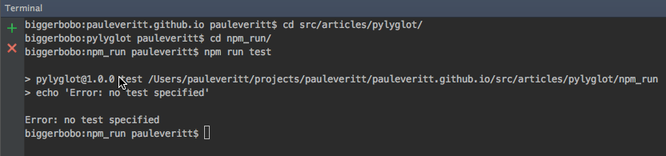
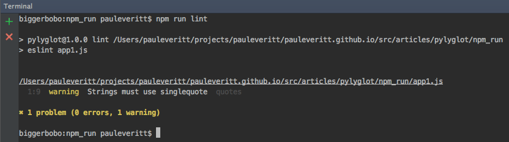

# Automation with `npm run` Scripts

Python has several ways to register custom scripts to execute during
development in a workspace. In this section we look at `npm run`
scripts, registered in `package.json`, for centralizing repeatable
frontend tasks.

## Overview

- Explain `npm run` scripts in the  `scripts` block of `package.json`

- Install a linter and hook into an `npm run` script

- Show how PyCharm puts a friendly face on such task scripts

- Explain the subtle benefit to `npm run` as a uniform interface

## Python Command Line Scripts

Let's say you have some tasks you do frequently during development:

- Run a linter to check for errors or style warnings

- Start a development server

- Run tests

- Package a release and publish to PyPi

You'd like to save yourself some work by automating these steps.
Even better, you are on a development team and you'd like the
automation to be in a natural, easily-discoverable place.

In Python...well, this is a lesser-known neighborhood. Python has
two main facilities for command-line scripts:

- Use 
  [setuptools cmdclass](https://docs.python.org/2/distutils/extending.html#integrating-new-commands)
  to register a command that can be run as an argument to `setup.py`,
  for example `python setup.py lint`

- Register a 
  [console script](http://python-packaging.readthedocs.org/en/latest/command-line-scripts.html#the-console-scripts-entry-point)
  to be added into your Python or virtualenv's `bin` directory

These approaches suffer from some of the historical baggage of
`distutils` and `setuptools`, plus they are a bit clunky. As such,
you don't often encounter them at the beginner or intermediate level in
Python.

Let's take a look at how to approach this in the frontend world.

## `npm run` scripts

As mentioned in the [package.json intro](../package_json/package_json.md)
article, the `package.json` configuration file can contain more than
just package name and dependency information.

Let's take a look at the auto-generated `package.json` file from the
[the ESLint article](../eslint/eslint.md):

By default, `npm init` created a `scripts` section in your package
file. In there, it registered one "run command": a `test` command.
With that `package.json` file, you could execute the `echo` command
via `npm`:

```
$ npm run test
```



Note how similar this command's structure looks to Python's `python
setup.py test`: an executable, followed by an argument, followed by the
custom, plugged-in target.

As explained in the 
[npm run](https://docs.npmjs.com/misc/scripts)
documentation, certain
`script` values such as `test` are pre-defined as a discoverable
interface, such as `test`, `start`, etc. For these, we can skip
`run` and just say:

```
$ npm test
```

For these certain, common tasks, you can walk up to a package and
run `npm <taskname>`, knowing that the project wired up that task
to do the task with some working implementation.

## Linting, Revisited

We can now register a script, both to simplify running our linter
but to also advertise this task to people that use our project. Let's
replace the (unimplemented) `test` entry in `package.json` with
a script for `lint`:

[include](../../../src/npm_run/package.json)

Presuming we still have the same `.eslintrc` file configured:

[include, lang:"json"](../../../src/npm_run/.eslintrc)

...then we can now run our linter from the command line in a simplified,
predicatable way:

```
$ npm run lint
```

This gives the same resulting `eslint` output from the previous article:



Not in our `scripts` block that we didn't have to specify the full
path to `node_modules/.bin/eslint`. When you run a script with
`npm run`, `node_modules/.bin` is added to the path automatically.
Also note that `npm run` scripts don't have to be JavaScript files:
as we saw in the boilerplate `test` command, it ran the system
`echo` command.

As you can see, this approach is far simpler and more "first class"
than Python automation. It still has rough edges. But it works
naturally for the basics.

## PyCharm Automation

Because there is a central place to look for tasks, PyCharm can put
a UI on finding and running these tasks. Right-click on your
`package.json` file and you will see a menu option for
`Show npm scripts`. You then get a panel showing the registered
run scripts. Double-clicking them runs that script in a tool window:

https://www.youtube.com/watch?v=4HVy4CKcBp4

This workflow is very helpful. It's nice to have the `npm` tool
window to browse your tasks, and of course, running a task in its
own run window is far better than running in the console.

> #### info::Note
>
> If you edit the scripts in `package.json`, you'll have to
> click the reload button in `npm` tool window.

## The Subtle Benefit

Certainly when compared to Python's approach to registering task
scripts, finding them, and running them, this `npm run` script
approach is quite nice. It's dead simple to make and use and
eliminates needing to type the full path. It can run tasks
implemented in JavaScript or any kind of executable on your path. As
such, it eliminates much of the need for task automation frameworks
such as `gulp` or `grunt`.

There is, though, a more subtle benefit. Your project now advertises
certain tasks it implements, registered with simple names, in
*configuration data file*, and in a predictable, standard location. Even
more, certain common task names are pre-defined. Choosing to implement
these means certain workflows, expected by tools like TravisCI, have a
"uniform interface", similar to the benefit we get from the HTTP and REST
uniform interface.

Because tasks are in a data file in a predictable place, tools such as
PyCharm can scan, list, and launch your project's tasks.

## Wrapup

In this article we introduced task automation via `npm run` scripts
registered in our package configuration file. We hooked up our linter
command to an automation script and showed the convenience PyCharm
adds for task automation.
