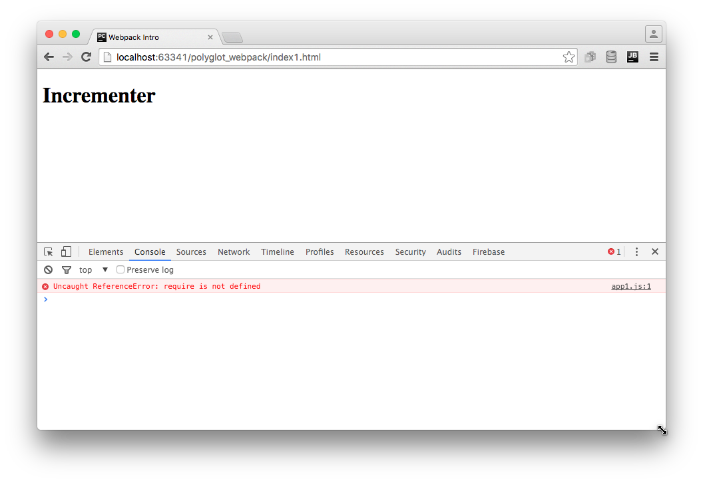
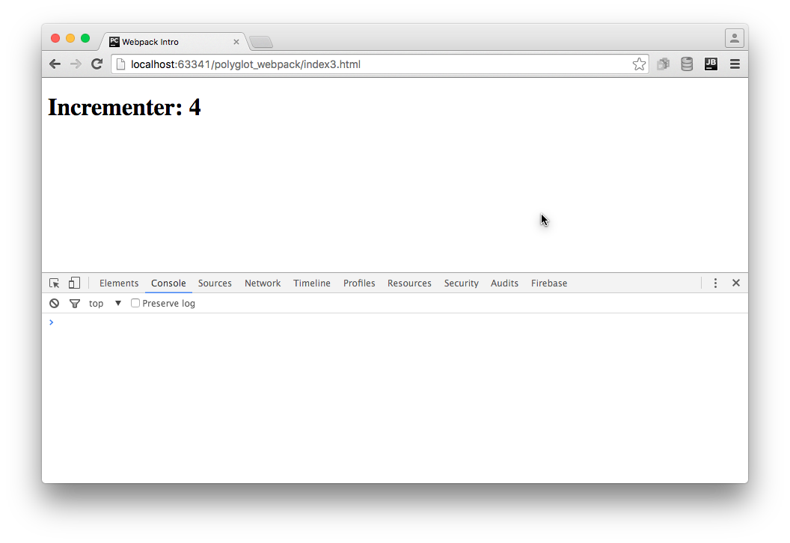
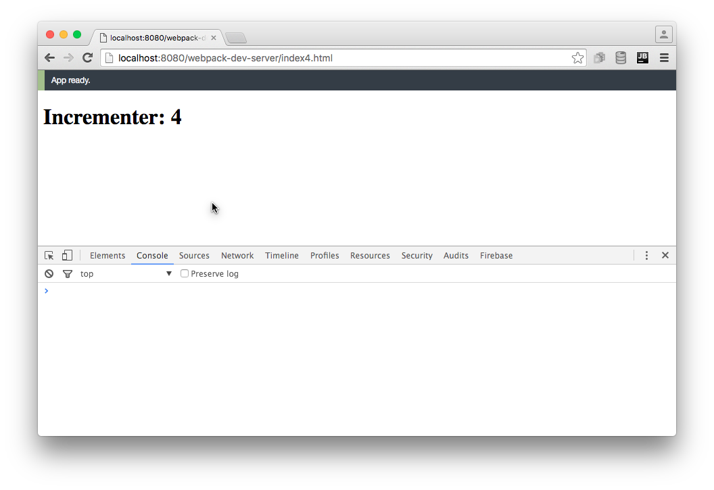

# Browser Bundling with Webpack

In our progress towards browserless, modular TDD, we wound up a spot
where...we can't run in a browser! Since browsers don't currently
support modules, and certainly not CommonJS modules, we need a way
to transform our code into a browser-friendly format.

In this section we look at using 
[Webpack](https://webpack.github.io)
to bundle our modular, CommonJS code into a single file fit for
the browser. Along the way, we also reduce our HTTP requests
by bundling our dependencies into the same file.

Finally, we end in a super spot: we switch to using Webpack's
development server, which re-bundles in-memory on every change *and*
automatically updates your browser, hands-free.

## Overview

- Show problem with using modules in a browser *without* a module loader

- Introduce and install Webpack

- Generate and use a bundle, including with external dependency

- Show live bundling and reloading with `webpack-dev-server`

## The Problem

Let's write a small web application, based around the `incrementer` in our 
[Modules with CommonJS](../modules/modules.md). First, an ``index1.html`` 
file:

[include](../../../src/webpack/index1.html)

This loads a file `app1.js`:

[include](../../../src/webpack/app1.js)

...which uses CommonJS modules to import `incrementer` from `./lib.js`:

[include](../../../src/webpack/lib.js)

PyCharm makes this easy to run. In the editor tab for `index1.html`,
mouse-over the symbol for one of the browsers and click it to open in
the internal PyCharm webserver:



As the screenshot shows, the browser console tells us we have a JavaScript
error `Uncaught ReferenceError: require is not defined`. Not surprising:
browsers don't support CommonJS export/import and modules, so `require`
is not available in a browser.

We need a module bundler. We'll use Webpack.

## Installation

Our goal is to take all of our Node-style, browserless, modular code
and combine it into a single `bundle.js` file, including jQuery as
a dependency. Let's use `npm` to install Webpack (and its development
server) as a *development* dependency:

```html
$ npm install --save-dev webpack webpack-dev-server
```

We can now run Webpack to "bundle" our files together:

```html
$ node_modules/.bin/webpack app1.js -o bundle.js
```

With this command, Webpack looks in `app1.js` for any `require`
imports, then in any of those imported files for more imports, and
bundles all the files into a single output file called `bundle.js`.

If we change our HTML to point at this `bundle.js` file:

[include](../../../src/webpack/index2.html)

...then we can see `4` in the browser console with no errors:


> #### info::Note
>
> What is the `bundle.js.map` file that got generated? Bundlers
> have a habit of making the tracebacks hard to follow back to
> the original line in the original file. The "source map"
> contains all the extra information needed for this. It is only
> loaded when the browser has the console window open for
> debugging. This source map can also be inlined into the
> `bundle.js` instead of into a separate file.

## Including Library Code

Imagine our frontend application used jQuery. In this case, included
via a `<script>` that pointed at a CDN:

[include](../../../src/webpack/index3.html)

Instead of logging the `incrementer` value to the console, we might
use jQuery to save it to the `<h1>` text node:

[include](../../../src/webpack/app2.js)

After re-bundling, this works fine in our browser:



However, we're not doing anything that feels like Pythonic development:

- Record a dependency on a version of jQuery

- Import jQuery into our application, rather than expecting it to
  magically appear as a global via `<script>`

Plus, we are making an extra HTTP request to get jQuery. Wouldn't it be
great if our frontend toolchain helped us manage this?

First we use `npm` to install jQuery as a dependency:

```html
$ npm install --save jquery
```

This gets the code into `node_modules` and adds an entry in
`package.json`. We now need to import it into our application code:

[include](../../../src/webpack/app3.js)

We can now eliminate the `<script>` that loads jQuery from CDN:

[include](../../../src/webpack/index4.html)

Loading `index4.html` in your browser via PyCharm shows this still
works. How did jQuery get in there? Webpack saw it imported, fetched
it, and included it.

We now have our external dependencies as part of our frontend toolchain
with revision control. Not too shabby. But we can take another, very
cool step forward.

> #### info::Note
>
> Why is bundle.map so big? It's now at 270 Kb. Well, jQuery isn't
> tiny. But also, we haven't done any work to make it smaller.
> Webpack can "minify", which strips out any comments and does lots
> of tricks for shrinking. Also, we are including the full jQuery.
> It is now available as multiple CommonJS submodules, so you can get
> only what you need. Or use a jQuery alternative.

## Live Bundling and Reload

It is certainly not fun having to re-bundle on every change. Wouldn't it
be nice if we had a tool that watched your files, and whenever anything
changed, would re-bundle? Or even better, provide a web server which
not only re-bundled, but told the browser to reload the page, hands-free?

The 
[Webpack Dev Server](https://webpack.github.io/docs/webpack-dev-server.html)
does just this.
In fact, it doesn't write a bundle file to disk. It keeps things in memory.

We installed it at the top of this article, so we can jump straight into
using it:

```html
$ node_modules/.bin/webpack-dev-server app3.js
```

As logged to your console, this starts a web server on port 8080, so you can
now load `http://localhost:8080/webpack-dev-server/index4.html`. You
should see:



Now, every time you make a change, the bundle will be regenerated *and* the
browser will reload the page. It's a seemingly-small, but in practice huge,
change in frontend development.

To make this more natural in PyCharm, we can first move the Webpack command
line options to a config file. By default, Webpack looks in
`webpack.config.js` in the project roo:

[include](../../../src/webpack/webpack.config.js)

We put in the options to drive both `webpack` and `webpack-dev-server`.
Next, let's automate this task by adding an `npm run` script in
`package.json`:

[include](../../../src/webpack/package.json)

Because `start` is a pre-defined shortcut, we can run `npm start` from
the command line. Or, we can let PyCharm browser our `package.json`'s
npm run scripts and execute `start` (and thus the `webpack-dev-server`)
in a run tool window.

## Wrapup

That wasn't too hard. Admittedly, that's because this introductory article
took the easiest possible course. As it turns out, bundling has a *ton* of
functionality and also thorny issues at nearly every turn.

It's one of the bittest pills in the frontend toolchain. On one hand, you
have the chance to radically improve your productivity and get a Pythonic
development cycle. On the other hand, you spend a large portion of your time
learning (constantly changing) tools and fighting the problems they introduce.

There are solutions to this. If you don't want to be bleeding edge, stick to
the minimum, such as the scope in this article.
